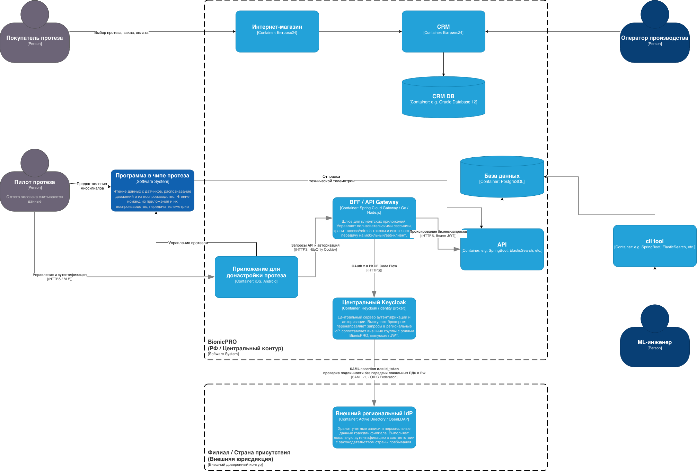

# Архитектурное решение: Управление учетными данными и безопасность (Задание 1)

## 1. Контекст и решаемые проблемы
В результате инцидента безопасности с использованием уязвимости перехвата токенов в публичном клиенте произошла утечка данных. Кроме того, выход BionicPRO на международные рынки накладывает строгие требования регуляторов (152-ФЗ, GDPR, HIPAA) по локализации хранения персональных (ПДн) и медицинских данных граждан в странах их присутствия.

## 2. Архитектура To-Be и ключевые решения

### 2.1. Трансграничная федерация удостоверений (Federated Identity)
- В стране филиала/представительства развертывается локальный Identity Provider (Active Directory / OpenLDAP / Local Keycloak), хранящий данные учетных записей локальных резидентов.
- Центральный Keycloak компании BionicPRO выступает в роли Identity Broker. Аутентификация иностранных пользователей происходит через редирект на их доверенный IdP по протоколам SAML 2.0 или OIDC Federation.
- В контур BionicPRO передается только криптографически подписанное утверждение (SAML assertion / OIDC ID Token).
- Выполняется маппинг внешних групп на внутренние роли системы (`prothetic_user`), при этом персональные и медицинские данные не покидают страну происхождения, требования законодательства не нарушаются.

### 2.2. Защита токенов и паттерн BFF (Backend for Frontend)
- Для исключения передачи и хранения access- и refresh-токенов на стороне клиентских приложений (SPA / Mobile) внедрен защитный шлюз BFF (API Gateway).
- Фронтенд взаимодействует с BFF исключительно через безопасные сессионные куки с флагами `HttpOnly`, `Secure`, `SameSite=Strict`.
- BFF берет на себя хранение токенов в защищенной серверной сессии, автоматическое обновление через refresh_token и проксирование запросов к внутреннему API с подстановкой заголовка `Authorization: Bearer <access_token>`.

### 2.3. Внедрение OAuth 2.0 Authorization Code Flow с расширением PKCE
- Для предотвращения атак перехвата авторизационного кода (Authorization Code Interception Attack) стандартный Code Grant дополнен расширением PKCE (Proof Key for Code Exchange, RFC 7636).
- На авторизационном сервере (Keycloak) для клиента зафиксировано обязательное использование метода проверки `code_challenge_method = S256`.

