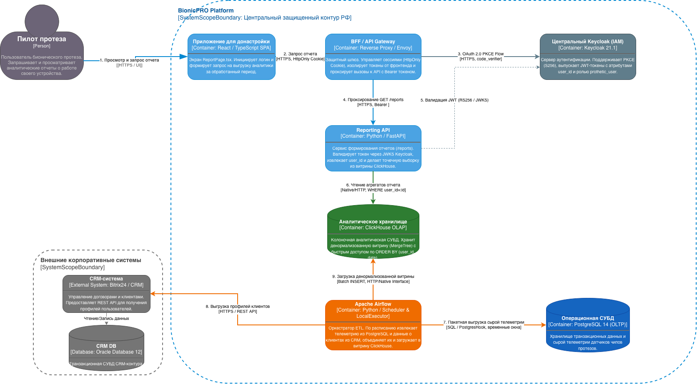
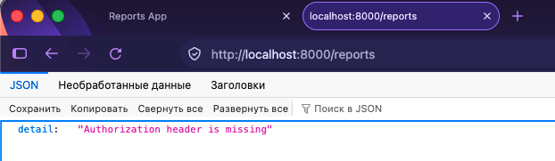
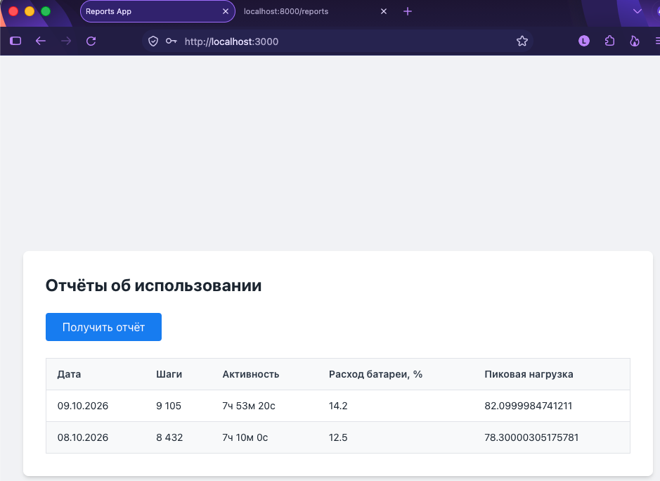

# Архитектурное решение: Аналитический контур и сервис отчётов (Задание 2)

## 1. Контекст и решаемые проблемы
В ходе эксплуатации платформы BionicPRO транзакционная СУБД (PostgreSQL) начала испытывать существенную деградацию производительности из-за смешения OLTP-нагрузки (потоковая запись телеметрии с чипов протезов) и тяжёлых аналитических запросов (агрегации по миллионам записей датчиков). Кроме того, пользователи потребовали предоставить им регулярные отчёты о функционировании их устройств с гарантией строгой конфиденциальности (доступ исключительно к своим показателям).

Для разделения типов нагрузки спроектирован выделенный аналитический контур на базе колоночной СУБД ClickHouse (OLAP), пакетного оркестратора Apache Airflow (ETL) и легковесного сервиса Reporting API.

---

## 2. Архитектура решения To-Be (C4 Container)

Спроектированная архитектура объединяет два независимых контура:
1. **Фоновый контур подготовки витрины (ETL)**: сбор сырых событий датчиков из PostgreSQL и данных о клиентах/договорах из CRM, их агрегация силами Apache Airflow и загрузка в аналитическое хранилище ClickHouse.
2. **Контур предоставления отчётов (Reporting)**: клиентский интерфейс (React SPA) обращается к Reporting API с Bearer-токеном Keycloak, бэкенд проверяет права и забирает предрассчитанные данные напрямую из витрины ClickHouse без длительных расчётов на лету.

---

## 3. Аналитическая витрина ClickHouse и ETL в Apache Airflow

### 3.1. Структура витрины данных (`clickhouse/init_mart.sql`)
Витрина реализована в виде широкой денормализованной таблицы `prosthetic_reports_mart`:
- **Движок**: `MergeTree()`
- **Сортировка и первичный ключ**: `ORDER BY (user_id, report_date)`
  - *Обоснование*: размещение строк на диске сгруппированно по `user_id` и дате гарантирует точечное чтение блока данных конкретного пользователя с минимальным I/O без сканирования всей таблицы.
- **Состав полей**:
  * Идентификаторы и профиль: `user_id`, `user_name`, `contract_number`, `prosthetic_id`
  * Временной срез: `report_date` (Date)
  * Аналитические метрики: `total_steps` (шаги за день), `active_time_seconds` (время активности), `battery_drain_avg` (средний разряд батареи), `load_level_max` (пиковая механическая нагрузка)
  * Метка расчёта: `created_at` (DateTime)

### 3.2. Пакетный ETL-пайплайн (`airflow/dags/telemetry_crm_mart_dag.py`)
- **Расписание**: `@daily` (`schedule_interval='@daily'`, `catchup=False`) — сбор выполняется ночью за прошедшие закрытые календарные сутки, исключая блокировки транзакционной БД в пиковые часы.
- **Этапы DAG**:
  1. `extract_telemetry`: инкрементальное чтение агрегатов датчиков из PostgreSQL за расчётные сутки по временному окну `[execution_date, execution_date + 1d)`.
  2. `extract_crm`: извлечение реестра клиентов и привязок протезов из CRM (REST API).
  3. `transform_and_aggregate`: обогащение телеметрии клиентскими атрибутами и денормализация в памяти воркера Airflow (Python).
  4. `load_clickhouse`: пакетная загрузка (`Batch INSERT`) плоских записей в витрину `prosthetic_reports_mart`.

---

## 4. Бэкенд Reporting API и безопасность данных

### 4.1. Архитектура сервиса (`api/main.py`)
Сервис реализован на FastAPI и предоставляет эндпоинт `GET /reports`:
- Чтение осуществляется строго из подготовленной витрины ClickHouse через параметризованный запрос `WHERE user_id = %(user_id)s`.
- На стороне бэкенда отсутствуют тяжёлые вычисления: данные считываются уже агрегированными, обеспечивая ответ за единицы миллисекунд.

### 4.2. Изоляция данных и контроль доступа (Задачи 3 и 4)
- **Валидация аутентификации**: API требует заголовок `Authorization: Bearer <access_token>`. Подпись JWT проверяется через JWKS Keycloak (`RS256`). Запросы без токена или с невалидным токеном отклоняются со статусом `401 Unauthorized`.
- **Строгая изоляция владения (Data Isolation)**: идентификатор пользователя извлекается непосредственно из криптографически подписанного токена (`preferred_username` / `sub`). Подмена `user_id` через параметры запроса невозможна — пользователь видит данные только своего протеза.

При попытке прямого обращения к эндпоинту `http://localhost:8000/reports` без токена авторизации сервис корректно отклоняет запрос:

*Рисунок 1. Результат негативного тестирования безопасности: эндпоинт защищён, возвращается HTTP 401 Unauthorized.*

### 4.3. Валидация расчётного периода
- Пакетный ETL Airflow формирует аналитику только за закрытые календарные периоды (до вчерашнего дня включительно).
- При передаче параметра `date_to >= today()` API возвращает исторические данные за закрытые дни, сопровождая ответ информационным предупреждением:
  `"warning": "Данные за текущий или незакрытый период ещё не рассчитаны Airflow. Доступны отчеты только до вчерашнего дня включительно."`

---

## 5. Пользовательский интерфейс (`frontend/src/components/ReportPage.tsx`)
- Кнопка формирования отчёта доступна только аутентифицированным пользователям.
- Запрос на `/reports` передаёт access-токен Keycloak в заголовке `Authorization: Bearer <token>`.
- Полученные суточные метрики отображаются в виде структурированной таблицы (дата, шаги, время активности, средний расход батареи и пиковая механическая нагрузка).
- При наличии в ответе поля `warning` (например, при запросе незакрытого периода) пользователю выводится информационное уведомление о статусе готовности данных.

Успешное получение и отображение исторического отчёта в интерфейсе приложения:

*Рисунок 2. Пользовательский интерфейс: таблица суточных метрик, полученных из аналитической витрины ClickHouse.*